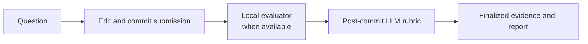

# Technical Interview Coach

**Practice technical interviews in your editor, commit to an answer, and get evidence-backed coaching without handing your workflow to a hosted platform.**

Technical Interview Coach pairs an LLM-led interview with local, deterministic checks and resumable file-based sessions. Use it for guided practice or a timed adaptive assessment across Python, NumPy, Pandas, SQL, statistics, and machine learning.


| Coaching that adapts | Work that stays real |
| --- | --- |
| **LLM-led coaching** presents one question at a time and reviews committed reasoning. | **Editor-first answers** live in ordinary Python, SQL, or Markdown files. |
| **Resumable practice** preserves local state and waits for your next action. | **Deterministic checks** test objective behavior locally before rubric review. |
| **Timed assessment** adapts difficulty while withholding feedback until completion. | **Client-independent files** work across supported coding agents without a plugin. |

## Five-Minute Start

Clone or download this repository. The coaching skill ships inside the clone at [`skills/technical-interview-coach/SKILL.md`](skills/technical-interview-coach/SKILL.md); it is not installed globally or through npm.

From the repository root, install the Python CLI and optional data dependencies:

```bash
python3 -m venv .venv
. .venv/bin/activate
python -m pip install --upgrade pip
python -m pip install -c constraints.txt ".[data]"
interview-coach validate
```

The validator should report `37 topics`, `50 questions`, `9 schemas`, and `22 deterministic evaluators`.

Python installation and skill discovery are separate checks: the commands above install the CLI and dependencies, while [`opencode.json`](opencode.json) registers the repository-local LLM behavior. Verify the skill file and OpenCode discovery before starting:

```bash
ls skills/technical-interview-coach/SKILL.md
opencode debug skill
```

The debug output should include `technical-interview-coach` and its repository-local `SKILL.md` path. Open the same repository folder in VS Code, then start OpenCode from that repository root:

```bash
opencode .
```

In OpenCode, run `/skills` and confirm that `technical-interview-coach` appears. Then ask:

> Start a study-mode technical interview practice session, present one question, and wait while I edit my answer in VS Code.

| Tool | Responsibility |
| --- | --- |
| **OpenCode / LLM** | Presents the learner-safe prompt, coaches according to the selected mode, and scores the committed answer against the post-commit rubric. |
| **VS Code / editor** | Holds the answer you can inspect, run, revise, and explicitly commit before review. |
| **Local CLI** | Owns session state, deterministic evidence, score constraints, progression, and reports. |

No global skill copy or provider-specific plugin is required. OpenCode drives the conversation; your editor and local files remain the working surface.

> **Skill discovery troubleshooting:** OpenCode loads configuration at startup. Start it from the repository root and restart it after changes to `opencode.json`, `AGENTS.md`, or `SKILL.md`. If `/skills` does not list `technical-interview-coach`, run `opencode debug skill` from the root. For clients or OpenCode versions that do not auto-discover it, explicitly load `skills/technical-interview-coach/SKILL.md` and follow [`AGENTS.md`](AGENTS.md).

## Choose a Flow

| | Practice | Assessment |
| --- | --- | --- |
| Best for | Learning, review, and targeted repetition | A realistic, bounded interview run |
| Default behavior | Feedback after finalization; hints depend on mode | 12 questions in 75 minutes |
| Progression | Manual: `next`, `retry`, `explain`, `change-topic`, or `finish` | Automatic after each accepted record |
| Difficulty | Selected for the session | Adaptive from recent finalized scores |
| Feedback | Available after each committed answer | Delayed until limit, timeout, or explicit finish |

Practice always pauses after recording an answer. Assessment always uses interview mode, starts at intermediate difficulty, preserves its category blueprint, and never reveals scores, correctness, hints, rubrics, or solutions while active. See [Coaching Workflows](docs/workflows.md) for the full disclosure and adaptation rules.

### Practice Example

```bash
interview-coach session start --flow practice --mode study --seed first-practice
interview-coach session current
```

Answer the displayed question in the scaffold or answer file. After the LLM and CLI finalize and record that answer, practice remains paused until you choose the next action:

```bash
interview-coach session next
```

### Assessment Example

Finish any active practice session before starting a separate assessment:

```bash
interview-coach session finish
interview-coach session start --flow assessment --seed mock-interview-1
interview-coach session current
```

The CLI advances after each finalized answer is recorded. When the assessment reaches its question limit, times out, or you run `interview-coach session finish`, release the latest completed report with:

```bash
interview-coach session report
```

## How Answers Are Evaluated

The project separates objective execution from subjective judgment. You commit to an answer first; only then can the LLM see the rubric and solution-oriented review context.



Local checks produce evidence, not automatic points. Failed checks cap only the rubric criteria they cover; passing checks make full credit possible but do not guarantee it. Conceptual and case-study answers skip deterministic execution and go directly to post-commit rubric review. This keeps correction useful without exposing internal rubrics, evaluator fixtures, hints, or solutions before commitment.

For a one-off implementation question, the local part of the workflow is:

```bash
interview-coach show q-python-003
interview-coach scaffold q-python-003 --output submissions/q-python-003
interview-coach evaluate q-python-003 submissions/q-python-003 \
  --output evidence/q-python-003.json
```

The LLM then uses `prepare-review` after commitment and returns criterion-level scores for `finalize`. See [Coaching Workflows](docs/workflows.md#hybrid-evaluation) for that boundary and [Canonical Data Model](docs/data-model.md) for the generated evidence and report contracts.

## Coverage

The curriculum maps **37 topics**: 26 currently have curated questions and 11 remain explicitly mapped as planned. The bank contains **50 globally ranked questions** spanning Python and algorithms, NumPy, Pandas, SQL, probability and statistics, mathematical foundations, machine-learning evaluation, specialized ML, APIs, and end-to-end project reasoning.

| Evaluation strategy | Questions | What runs |
| --- | ---: | --- |
| `executable` | 5 | Standard-library Python in a child process |
| `sql` | 7 | Read-only queries against fresh in-memory SQLite fixtures |
| `dataframe` | 5 | Pandas submissions in a child process |
| `numeric` | 5 | NumPy-based submissions in a child process |
| `rubric_only` | 28 | Post-commit LLM review for reasoning-led answers |

All 10 implementation, 7 SQL-query, and 5 data-manipulation questions have deterministic checks. Read the [Curriculum Map](docs/curriculum.md) for topic status and selection semantics.

## Use Another Coding Agent

The workflow is file-first and compatible with **OpenCode, Codex, and Claude Code**. Codex and Claude compatibility remains file-based: point the client at the project’s [technical interview coach skill](skills/technical-interview-coach/SKILL.md) and [`AGENTS.md`](AGENTS.md). They do not use `opencode.json` for skill discovery.

Example client instruction:

> Load `skills/technical-interview-coach/SKILL.md`, start a practice session, and do not reveal rubric or solution guidance before I commit my answer.

The CLI and canonical JSON/JSONL files remain authoritative, so changing the conversational client does not change session or evaluation contracts.

## Safety Boundary

Run only **trusted local submissions**. Python answers execute with timeouts, a minimal environment, an isolated temporary working directory, bounded output, and best-effort POSIX resource limits, but this is not a hostile-code sandbox. Use a disposable container or VM for untrusted code.

SQL evaluators deny writes and schema changes against fresh in-memory fixtures. The supported targets are **macOS and Linux** with Python 3.11 or newer; Windows is not supported by the current process-resource controls.

Learner answers, evidence, active state, and completed sessions belong in ignored local directories. Repository users can inspect packaged evaluator fixtures, so the boundary protects interview flow, not cryptographic secrecy. See [Coaching Workflows](docs/workflows.md) and [Canonical Data Model](docs/data-model.md) for deeper workflow, persistence, and privacy details.

## Project Map

| Path | Purpose |
| --- | --- |
| [`src/interview_coach/`](src/interview_coach/) | CLI, sessions, evaluators, and finalization rules |
| [`curriculum/topics.json`](curriculum/topics.json) | Canonical 37-topic curriculum |
| [`data/questions/`](data/questions/) | Canonical ranked question bank |
| [`schemas/`](schemas/) | Interoperable question, state, evidence, and report contracts |
| [`skills/technical-interview-coach/`](skills/technical-interview-coach/) | Client-independent coaching behavior |
| [`tests/`](tests/) | CLI, evaluation, disclosure, session, and portability tests |

## Documentation

- [Coaching Workflows](docs/workflows.md): practice, assessment, disclosure, adaptation, and hybrid review.
- [Canonical Data Model](docs/data-model.md): local records, identities, state, and schema evolution.
- [Curriculum Map](docs/curriculum.md): topic taxonomy and availability.
- [Contributing](CONTRIBUTING.md): authoring and verification expectations.

## Status and License

The current source package version is **0.2.0**. It is installable from this repository, declares Python 3.11+ compatibility, includes 50 questions and 22 deterministic evaluators, and contains 29 test cases.

Licensed under the [Apache License 2.0](LICENSE). Maintained by the Technical Interview Coach contributors; contributions should follow [CONTRIBUTING.md](CONTRIBUTING.md).
